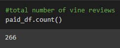
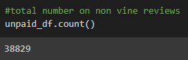

# Amazon Vine Analysis

## Overview
How are the reviews on Amazon affected by members of the paid Amazon Vine program? 

Amazon vine porgram is a service that allows manufacturers and publishers to receive reviews for their products. Companies pay a fee to Amazon and provide products to Amazon Vine members, who are then required to publish a review of that product. 

## Results

- How many Vine Reviews are there?

- How many Non-Vine Reviews are there?

- How many Vine Reviews were given 5-stars?

- How many Non-Vine Reviews were given 5-stars?

- What percentage of Vine reviews were 5-stars? 

- What percentage of Non-Vine reviews were 5-stars?

## Summary
Overall, there seems to be very little to no positivity bias when it comes to reviews that are received from the Vine program. This is supported by the results from the analysis above. First of all there are very few reviews received from the Vine program, 266 in total. The total number of reviews for the products were 39,095. That means that less than 1% (.68%) of the total votes come from the Vine program. The overall percentage of 5 star reviews that came from the vine program came out to 46.9925%. THe percentage of 5 star reviews from the non-vine reviews is 46.9906%. There is a miniscule difference between the results. That means that the reviews that are paid for, are not more positive than normal reviews. 

This analysis was only performed on data from the Home Improvement category on Amazon. To get a better idea of the positivity bias on the Vine program, it is recommended to perform the same analysis on several different categories across Amazon to see it they provide the same results.  
