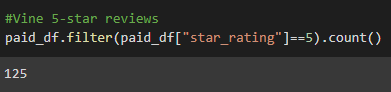
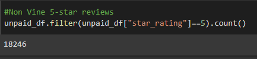
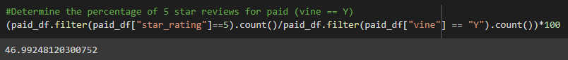
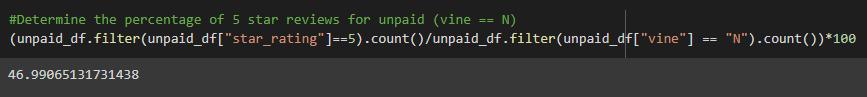

# Amazon Vine Analysis

## Overview
How are the reviews on Amazon affected by members of the paid Amazon Vine program? 

Amazon vine porgram is a service that allows manufacturers and publishers to receive reviews for their products. Companies pay a fee to Amazon and provide products to Amazon Vine members, who are then required to publish a review of that product. 

## Results

- How many Vine Reviews are there?

- How many Non-Vine Reviews are there?

- How many Vine Reviews were given 5-stars?

- How many Non-Vine Reviews were given 5-stars?

- What percentage of Vine reviews were 5-stars? 

- What percentage of Non-Vine reviews were 5-stars?

## Summary
